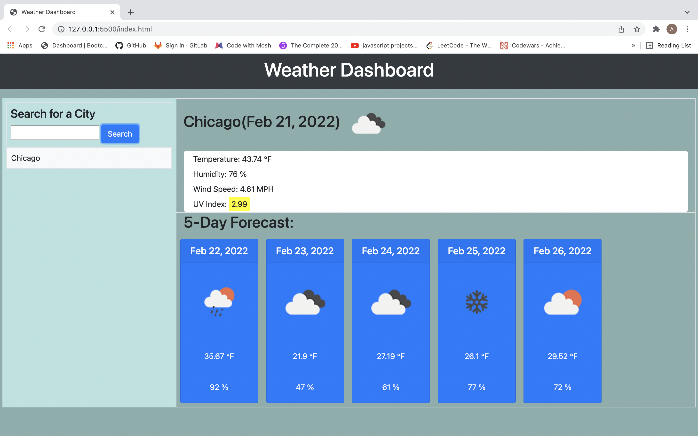
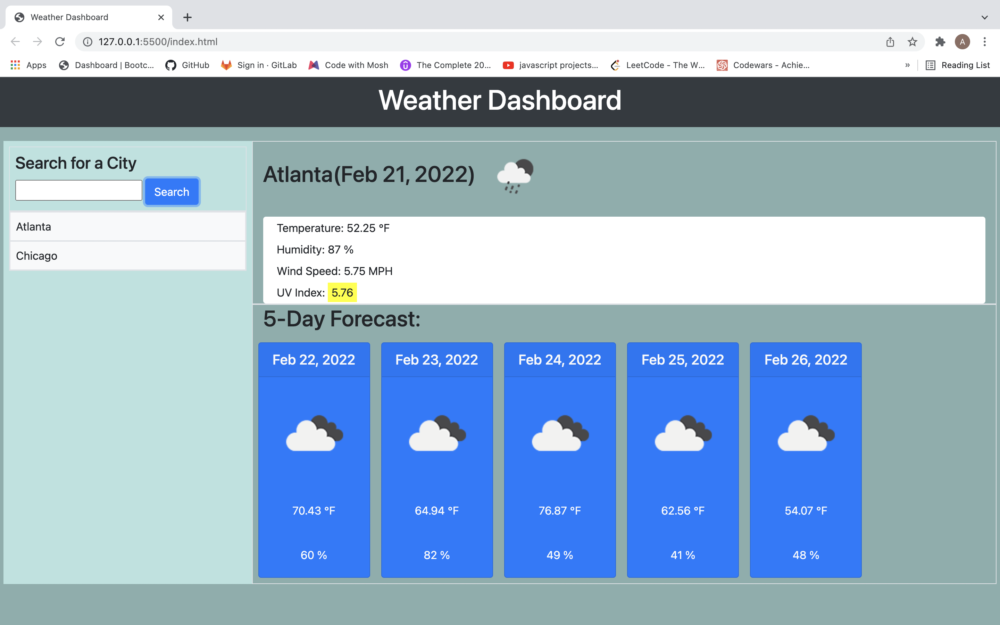

# Weather-Dashboard
# ReadMe Generator
   

  ## Table of contents:
 * [Description](#description)
 * [Installation](#installation)
 * [Usage](#usage)
 * [Contributors](#contributors)
 * [Questions](#questions)
  ### Description:
  This is a program that shows you the weather in your area using openweathermap API! You can search for any city and see a 5 day weather forecast that includes the    temperature, windspeed, and UvIndex.
  
  Screenshots of running program:  
  
  ### Installation:
  No need to install anything to use this app!
  ### Usage:
  Example of how to use this program: You can use this app by going to my deployed website and typing in any city you like in the searchbar! The page will show you   the current weather plus a forecast of the next 5 days!
  ### License:
  This project is licensed under: MIT
  ### Contributors:
  Abdirahman

  ### Questions:
  If you have any questions contact Abdirahman on [Github](https://github.com/aden-abdirahman)
  or [Email](https://aden.abdirahman45@gmail.com)
